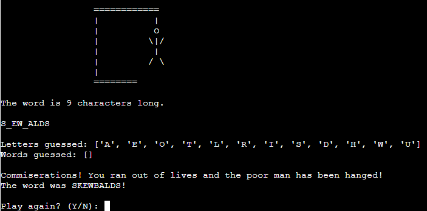

# Hangman
Hangman is a Python terminal game, which is run in the Code Institute mock terminal and hosted on Heroku.

Users will be asked to guess a random word by typing in letters or words. The challenge is to guess the word before the poor man is hanged.

## How to play
Firstly, the user will be asked for their name and once submitted, the game will begin.

The user will be given a random word with each letter being represented by the **_** symbol. This will give the user the total length of the word.

They will then be prompted to input a letter or a word as their guess.

Letters guessed must be from within the standard English alphabet. Guessed words must be the same length as the randomly generated word and only contain characters from the standard English alphabet.

For each correct letter guessed, the **_** symbols will be replaced with the correctly guessed letter. For each incorrect guess (letter or word), the user will lose a life and the man will move one step closer to being hanged.

If the user correctly guesses the word, they will be presented with a congratulatory message and asked if they would like to play again.

If the user runs out of lives, the man will unfortunately be hanged, the user will be presented with a commiseratory message and asked if they would like to play again.

The user will be warned if they have already guessed a letter and told to guess again. This will not result in the loss of a life.

## Features

### Welcome Message

Upon loading, the user will be presented with a welcome message, detailing the game and how to begin.

### Username Prompt

The user will be prompted to submit a username and once provided, the game will begin. The user is notified that their username must be between 1 and 10 characters and only contain letters included in the standard English alphabet. If the username does not meet the requirements, the user will be notified that it is not valid and to try again. Once a valid username has been entered, the game will begin.

*Username Input* 

*Username Validation* 

### Hangman Gallows

Once the game begins, the empty gallows will be displayed and updated with each incorrect guess. Once the user is out of tries, the fully hanged man will be displayed.

*Start of Game* 

*Incorrect Guess* 

### Word

A random word will be selected from an API or if unsuccessful in loading from the API, a word will be selected from a prewritten backup list. The API used is from [random-word-api](http://random-word-api.herokuapp.com/home "random-word-api") and creates a list of 100 words to select from.

The word will be displayed with each letter represented by the **_** symbol. With each correct letter guess, the correctly guessed letter(s) will then replace the underscore at the correct position in the word.

*Letters Guessed Correctly* 

### List of guessed letters

The user will be presented a list of their already guessed letters. This will allow the user to keep track of what they have already tried.

### List of guessed words

If the user incorrectly guesses a word, this word will be added to a list of incorrect word guesses and displayed for the user.

*Word Guessed* 

### Guess Validation

If the user tries to guess multiple letters which is not equal to the length of the word, an error will occur and the user will be notified that their guess is not valid. The same will happen if the user tries to submit a character not within the standard English alphabet.

*Invalid Word Length Validation* 

*Invalid Character Guess* 

### Completion Message

The user will receive either a congratulatory or commiseratory message depending on whether they were successful or not.

*Congratulatory Message* 

*Commiseratory Message* 

### Play again

Once the game is complete, whether that resulted in a win or a loss for the user, a prompt will appear for the user to start again by typing either Y for yes and N for no. If the user inputs a character other than Y or N, a validation error will occur. The user can also submit a lowercase Y or N and yes or no as validation is done by splicing the first letter and converting to uppercase.

*Play Again Validation* 

## Testing

Thorough testing has been completed throughout the project's development. Upon completion, testing has been carried out to ensure all features work correctly and all user inputs go through validation. All information regarding feature testing is displayed in the table below.

| Feature Tested        | Feature Description                                                                                                           | Testing Completed                                                                                                                              | Expected Outcome                                                                                                                                                                                                                                                                                      | Result       |
|-----------------------|-------------------------------------------------------------------------------------------------------------------------------|------------------------------------------------------------------------------------------------------------------------------------------------|-------------------------------------------------------------------------------------------------------------------------------------------------------------------------------------------------------------------------------------------------------------------------------------------------------|--------------|
| Welcome Message       | Welcome message and username  input field displayed.                                                                       | Run program.                                                                                                                                   | Welcome message and username should be displayed.                                                                                                                                                                                                                                                  | As expected. |
| Username Input        | User can input username adhering to requirements.                                                                          | Input invalid and valid username.                                                                                                           | Upon invalid username input, user will be notified that it is not valid and to try again. Upon valid input, game will start.                                                                                                                                                                 | As expected. |
| Get Word              | Random word pulled from API list or backup list.                                                                           | Fetch word from API and from backup list. Tested via printing fetched word. To test backup list, API URL was made to be incorrect. | Word should be selected at random from API fetched list or from backup list if API fetch fails.                                                                                                                                                                                                 | As expected. |
| Start Game Message    | Message appears at game start with given username.                                                                         | Input username to initiate game start.                                                                                                      | Message should appear at game start which includes username given by user.                                                                                                                                                                                                                         | As expected. |
| Display Hangman       | Display hangman at different stages.                                                                                          | Start game to initiate display of first stage and intentionally lose lives to display further stages of  hangman gallows.             | Hangman gallows should first display empty and update with every life lost.                                                                                                                                                                                                                        | As expected. |
| Word length Message   | User notified of the length of word.                                                                                          | Start game to initiate display if word length message.                                                                                      | Message with length of word should be displayed.                                                                                                                                                                                                                                                   | As expected. |
| Display Word          | Word displayed with every letter initially replaced with underscore.                                                       | Start game to initiate display of hidden word.                                                                                              | Hidden word should be displayed as a  number of underscores equal to length of word.                                                                                                                                                                                                            | As expected. |
| Guess Input           | Input field for user to submit guess                                                                                          | Start game to initiate guess input field.                                                                                                   | Guess input field should appear at bottom of game.                                                                                                                                                                                                                                                 | As expected. |
| Guess Validation      | Validates user guesses.                                                                                                       | Try valid and invalid guesses.                                                                                                                 | Upon invalid guess, user should be notified that guess and told to guess again. User  should not lose life for invalid guess.  If guess has already been tried, user should be notified and not lose a life. If valid, user should be notified whether or not it guess was correct. | As expected. |
| Update Word           | Upon successful letter guess, hidden word will update to display correct letter guessed at correct position in word. | Guess letter correctly.                                                                                                                        | If letter guessed is correct, hidden word should update to replace underscores with correct letter at correct position.                                                                                                                                                                         | As expected. |
| Letters Guessed List  | Any letters guessed will be added to  list and displayed for user.                                                         | Guess letters.                                                                                                                                 | When a letter is guessed by user, letters guessed list should update and be displayed for user.                                                                                                                                                                                                 | As expected. |
| Words Guessed List    | Incorrect words guessed will be added to list and displayed for user. If correct word guessed, game will end.           | Guess words.                                                                                                                                   | When an incorrect word is guessed, words guessed list updated and displayed for user. If correct word is guessed, game will end.                                                                                                                                                                | As expected. |
| Completion Message    | Upon game completion, message will be displayed congratulating or commiserating user.                                   | Complete game by failing and winning.                                                                                                       | When user wins, congratulatory message should display and commiseratory message when user loses.                                                                                                                                                                                                | As expected. |
| Play Again Prompt     | Upon game completion, user is asked if they would like to play again.                                                      | Complete game.                                                                                                                                 | When game completed, prompt should appear to allow user to close game or start again. Game should restart if user input yes and program should exit if input is no.                                                                                                                          | As expected. |
| Play Again Validation | Validate play again input from user.                                                                                          | Invalid input given to play again prompt.                                                                                                   | If user gives invalid input to play again  prompt they should be notified and allowed to try again.                                                                                                                                                                                             | As expected. |

